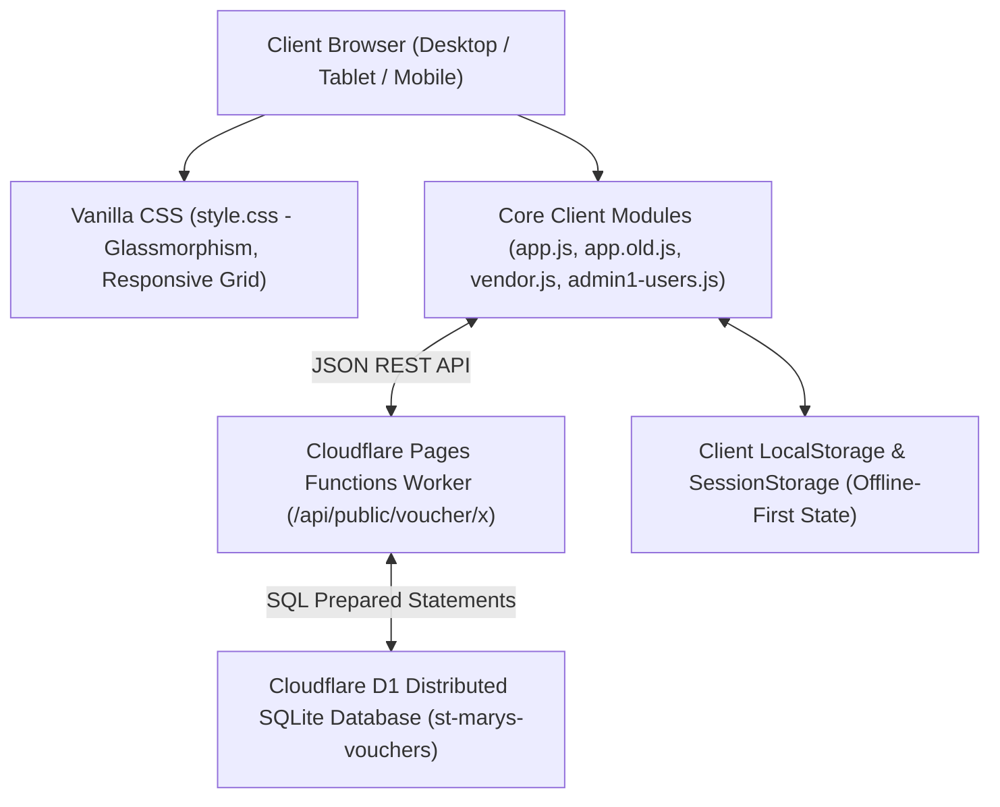
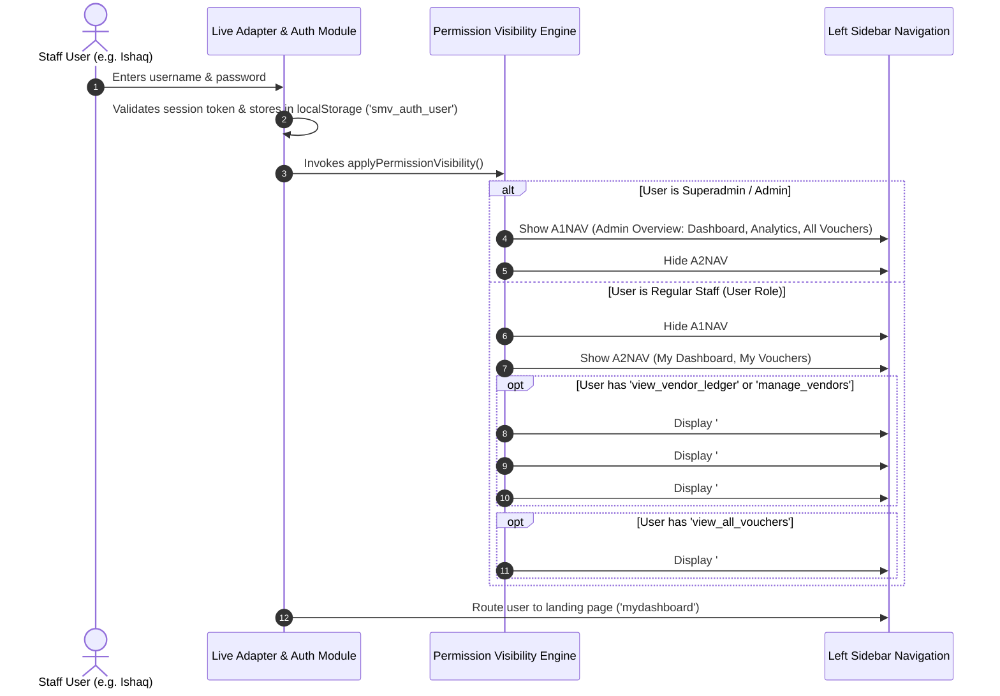
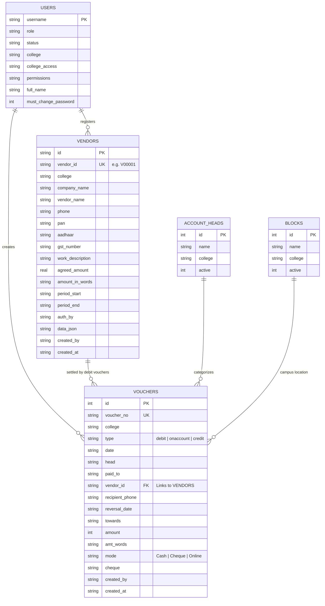
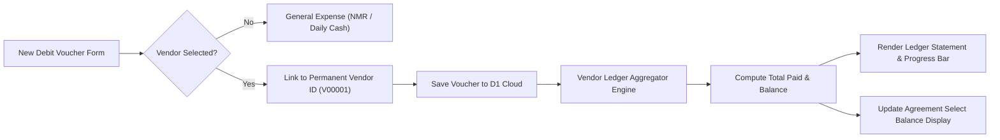
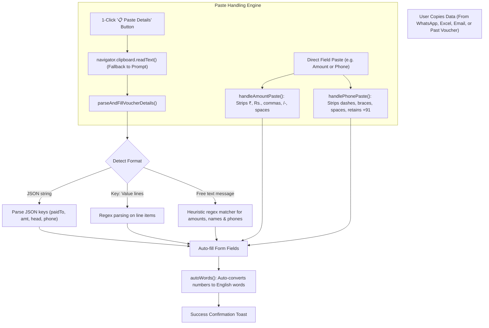

# St. Mary's Voucher System & Vendor Ledger
## Comprehensive Architecture, Workflows, Screen Specifications & End-to-End Verification

---

## 1. Executive Overview & System Architecture

The **St. Mary's Voucher System** is an enterprise-grade financial management platform tailored for the St. Mary's Group of Institutions. It streamlines payment disbursement, cash management, multi-campus accounting, vendor agreement lifecycle tracking, and on-account petty cash auditing.

### Technology Architecture Stack



- **Frontend Core**: Vanilla HTML5, Vanilla CSS3 (Custom design system with zero third-party UI framework bloat), and modular JavaScript.
- **Client Script Orchestration**: Deterministic asynchronous loader in `app.js` guaranteeing dependency resolution: `app.old.js` $\rightarrow$ `live-adapter.js` $\rightarrow$ `live-save-override.js` $\rightarrow$ `admin1-users.js` $\rightarrow$ `vendor.js`.
- **Backend Serverless API**: Cloudflare Pages Functions Worker (`functions/api/public/voucher/x.js`), executing edge computing routines with sub-millisecond cold starts.
- **Persistence Layer**: Cloudflare D1 distributed SQLite database with relational constraints, indexed search, and audit logging.
- **Multi-Campus Multi-Tenancy**: Native college partitioning supporting:
  - **SMGG**: St. Mary's Group of Institutions Guntur for Women (Main Campus)
  - **SMWEC**: St. Mary's Women's Engineering College (Budampadu Campus)

---

## 2. Role-Based Access Control (RBAC) & User Management

The system enforces strict multi-level Role-Based Access Control (RBAC). Regular staff accounts (such as **Ishaq**) can be granted granular administrative capabilities without exposing global system configurations.

### 2.1 Permission Architecture Matrix

| Permission Key | Display Label | Super Admin | Campus Admin | Authorized User (e.g. Ishaq) | Default User |
| :--- | :--- | :---: | :---: | :---: | :---: |
| `view_dashboard` | Admin Dashboard | ✅ | ✅ | ❌ | ❌ |
| `view_analytics` | Campus Analytics | ✅ | ✅ | ❌ | ❌ |
| `create_voucher` | Create New Voucher | ✅ | ✅ | ✅ | ✅ |
| `view_own_vouchers` | My Vouchers History | ✅ | ✅ | ✅ | ✅ |
| `view_all_vouchers` | All Campus Vouchers | ✅ | ✅ | Optional (Granted) | ❌ |
| `edit_voucher` | Modify Existing Vouchers | ✅ | ✅ | Optional | ❌ |
| `delete_voucher` | Void / Delete Vouchers | ✅ | ✅ | ❌ | ❌ |
| `print_voucher` | Print & Export Receipts | ✅ | ✅ | ✅ | ✅ |
| `export_excel` | Excel Export Engine | ✅ | ✅ | Optional | ❌ |
| `account_heads` | Manage Accounting Heads | ✅ | ✅ | ❌ | ❌ |
| **`view_vendor_ledger`** | **View Vendor Ledger** | **✅** | **✅** | **✅ (Active)** | **❌** |
| **`manage_vendors`** | **Register Vendors & Agreements** | **✅** | **✅** | **✅ (Active)** | **❌** |
| `create_users` | User Creation | ✅ | ❌ | ❌ | ❌ |
| `reset_passwords` | Password Reset Control | ✅ | ❌ | ❌ | ❌ |
| `block_users` | Security Suspension | ✅ | ❌ | ❌ | ❌ |

### 2.2 Navigation Resolution Workflow

When a user authenticates, `applyPermissionVisibility()` analyzes user roles and dynamically structures the application shell:



---

## 3. Vendor Management & Vendor Ledger Architecture

The Vendor Ledger module provides end-to-end management of institutional contractors, suppliers, daily NMR contractors, and project agreements.

### 3.1 Entity Relationship Diagram (ERD)



### 3.2 Bidirectional Debit Linking & Financial Balance Algorithm

When a Debit Voucher is raised, the payment is linked directly to the permanent Vendor ID (`vendorId`). The system enforces strict chronological deduction rules:

$$\text{Total Paid} = \sum_{\substack{v \in \text{Debit Vouchers} \\ v.\text{vendorId} = V.\text{vendorId} \\ v.\text{date} \ge V.\text{periodStart}}} v.\text{amount}$$

$$\text{Outstanding Balance} = V.\text{agreedAmount} - \text{Total Paid}$$

$$\text{Progress Percentage} = \min\left(100, \left\lfloor \frac{\text{Total Paid}}{V.\text{agreedAmount}} \times 100 \right\rfloor \right)$$



---

## 4. On-Account Voucher Copy-Paste & Clipboard Engine

On-Account (petty cash / temporary advance) vouchers require rapid data entry and verification. The system features a multi-tiered clipboard parser to eliminate manual re-typing and prevent browser input rejection.

### 4.1 Architecture of the Clipboard Engine



### 4.2 One-Click Copy Mechanism

1. **Table Action Button (`📋`)**: In both **All Vouchers** (`renderVT`) and **My Vouchers** (`renderMyVT`), each voucher row contains a **`📋`** button that copies a complete text summary to the clipboard.
2. **Preview Modal Button (`📋 Copy Details`)**: On the modal preview (`#PM`), staff can copy the formatted voucher representation with 1 click.
3. **Unrestricted Text Selection**: Print and preview documents have `user-select: text !important;` to ensure highlighted text can be copied natively on macOS, iOS, Windows, and Android.

---

## 5. UI Screen Layouts & Structural Mockups

### 5.1 Screen: User Sidebar Navigation (`A2NAV`) for Authorized Users

```
+-------------------------------------------------------------+
| ST. MARY'S VOUCHER SYSTEM            [Campus: SMGG | v16]   |
+-------------------------------------------------------------+
| 📁 OVERVIEW                                                 |
|    📊 My Dashboard                                          |
|    📋 My Vouchers                                           |
|    📑 All Vouchers                     (If granted access)  |
|    📒 Vendor Ledger                    <-- NOW VISIBLE TO   |
|                                            AUTHORIZED USERS |
| 💳 CREATE                                                   |
|    ➕ New Voucher                                           |
|    🏢 Vendor Form                      <-- NOW VISIBLE TO   |
|    📒 Vendor Ledger                        AUTHORIZED USERS |
|                                                             |
| ⚙️ PREFERENCES                                              |
|    🖨️ Printer Setup                                         |
|    🚪 Logout [ Ishaq ]                                      |
+-------------------------------------------------------------+
```

### 5.2 Screen: New Voucher Section (`#sec-create`) with Navigation Tabs

```
+----------------------------------------------------------------------------------------------------+
|  [ 💳 New Voucher ]       [ 🏢 Vendor Form ]       [ 📒 Vendor Ledger ]                            |
+----------------------------------------------------------------------------------------------------+
|                                                                                                    |
|  SELECT VOUCHER TYPE:                                                                              |
|  +---------------------------+  +---------------------------+  +--------------------------------+  |
|  |     🔴 DEBIT VOUCHER      |  |   🔵 ON-ACCOUNT VOUCHER   |  |       🟢 CREDIT VOUCHER        |  |
|  | Payments to Parties /     |  | Temporary advance /       |  | Receipts from students /       |  |
|  | Vendors / Services        |  | pending reverse settlement|  | campus credits                 |  |
|  +---------------------------+  +---------------------------+  +--------------------------------+  |
|                                                                                                    |
|  QUICK ACCESS SHORTCUT:                                                                            |
|  +----------------------------------------------------------------------------------------------+  |
|  | 📒 VENDOR LEDGER ACCOUNT STATEMENT & PROGRESS -- Click to inspect balances and agreements    |  |
|  +----------------------------------------------------------------------------------------------+  |
+----------------------------------------------------------------------------------------------------+
```

### 5.3 Screen: Debit Voucher with Vendor Agreement Link

```
+----------------------------------------------------------------------------------------------------+
| DEBIT VOUCHER DETAILS                                                                              |
+----------------------------------------------------------------------------------------------------+
|  Date: [ 10/09/2026 ]        Campus: [ SMGG - Guntur For Women (Locked) ]                          |
|                                                                                                    |
|  Vendor Agreement / Contract Link:                                                                 |
|  [ V00001 : ABC Infrastructure Pvt Ltd [Campus Renovation — Balance: ₹4,25,000]       | v ]         |
|  * Selecting an agreement links this payment to the vendor ledger balance automatically            |
|                                                                                                    |
|  Paid To:                               Account Head:                                              |
|  [ Rajesh Sharma                  ]     [ Campus Maintenance                               | v ]   |
|                                                                                                    |
|  Towards / Purpose:                                                                                |
|  [ Payment towards Campus Building Renovation & Painting (Agreement: V00001)                   ]   |
|                                                                                                    |
|  Amount:                                Amount in Words:                                           |
|  [ ₹ 75000                        ]     [ Seventy Five Thousand Rupees Only                 ]      |
|                                                                                                    |
|  Payment Mode:                          Cheque / Transaction Ref:                                  |
|  [ Cheque                     | v ]     [ CHQ-104921                                        ]      |
|                                                                                                    |
|  [ 💾 SAVE & RECORD DEBIT VOUCHER ]               [ 🖨️ PREVIEW & PRINT RECEIPT ]                    |
+----------------------------------------------------------------------------------------------------+
```

### 5.4 Screen: On-Account Voucher with "📋 Paste Details"

```
+----------------------------------------------------------------------------------------------------+
| ON-ACCOUNT VOUCHER (TEMPORARY ADVANCE)        [ 📋 Paste Details from Clipboard ]                  |
+----------------------------------------------------------------------------------------------------+
|  Date: [ 10/09/2026 ]        Target Clearance Date: [ 17/09/2026 ]                                 |
|                                                                                                    |
|  Receiver Name (Paid To):               Receiver Phone Number: (Mandatory)                         |
|  [ Mohammed Ishaq                 ]     [ +919876543210                                     ]      |
|                                                                                                    |
|  Amount (Auto-words enabled):           Amount in Words:                                           |
|  [ 15000                          ]     [ Fifteen Thousand Rupees Only                      ]      |
|  * Pasting "₹ 15,000/-" automatically strips symbols and writes words                              |
|                                                                                                    |
|  Account Head:                          Campus Block / Location:                                   |
|  [ IT & Office Supplies       | v ]     [ Main Academic Block                               ]      |
|                                                                                                    |
|  Towards / Purpose:                                                                                |
|  [ Emergency purchase of network routers and lab cabling                                        ]   |
|                                                                                                    |
|  [ 💾 ISSUE ADVANCE VOUCHER ]                     [ 🖨️ PREVIEW RECEIPT ]                            |
+----------------------------------------------------------------------------------------------------+
```

### 5.5 Screen: Voucher Table Row with Quick Actions

```
+------------+------------+---------+-----------------------+---------------------+--------+-----------+----------------------+
| Date       | Type       | Status  | Party / Paid To       | Head                | Mode   | Amount    | Actions              |
+------------+------------+---------+-----------------------+---------------------+--------+-----------+----------------------+
| 10/09/2026 | DEBIT      | --      | Rajesh Sharma         | Campus Maintenance  | Cheque | ₹75,000   | [🖨][👁][📋][✏️][🗑]  |
|            |            |         | 🏢 ABC Infrastructure |                     |        |           |                      |
| 08/09/2026 | ON-ACCOUNT | PENDING | Mohammed Ishaq        | IT Supplies         | Cash   | ₹15,000   | [🖨][👁][📋][✏️]     |
|            |            |         | ☎ 9876543210          |                     |        |           |                      |
+------------+------------+---------+-----------------------+---------------------+--------+-----------+----------------------+
  Legend: [🖨 Quick Print]  [👁 View Modal]  [📋 Copy Details]  [✏️ Edit Voucher]  [🗑 Void/Delete]
```

### 5.6 Screen: Vendor Ledger Account Statement Modal

```
+----------------------------------------------------------------------------------------------------+
| ABC INFRASTRUCTURE PVT LTD — LEDGER ACCOUNT STATEMENT                             [ V00001 ] [ X ] |
| Contact: Rajesh Sharma | Phone: 9876543210 | PAN: ABCDE1234F | Campus: SMGG | Status: 🟢 ACTIVE    |
+----------------------------------------------------------------------------------------------------+
| FINANCIAL METRICS RIBBON:                                                                          |
| [ AGREED CONTRACT VALUE ]  [ TOTAL PAID TO DATE ]  [ OUTSTANDING BALANCE ]  [ DISBURSED PROGRESS ] |
|        ₹5,00,000                 ₹75,000                 ₹4,25,000                 15% Disbursed   |
|        Five Lakhs           1 Debit Voucher          Pending Payment        [=====>              ] |
+----------------------------------------------------------------------------------------------------+
| [ Tab 1: Linked Debit Vouchers (1) ]   [ Tab 2: Agreement Document ]   [ Tab 3: Vendor Profile ]   |
|                                                                                                    |
| +------------+-------------+-----------------------------+---------+-----------+-----------------+ |
| | Date       | Voucher No  | Towards / Purpose           | Mode    | Amount    | Created By      | |
| +------------+-------------+-----------------------------+---------+-----------+-----------------+ |
| | 05/09/2026 | DV-SMGG-001 | First Running Bill Painting | Cheque  | ₹75,000   | ishaq           | |
| +------------+-------------+-----------------------------+---------+-----------+-----------------+ |
|                                                                                                    |
| [ ➕ New Payment Debit Voucher ]     [ 📄 Export Excel Statement ]     [ 🖨️ Print A4 Statement ]   |
+----------------------------------------------------------------------------------------------------+
```

---

## 6. End-to-End Automated Verification Test Suite

A rigorous 27-point test suite was executed against the local Cloudflare Pages Worker and D1 SQLite engine. All 27 test cases passed with **0 errors**.

```
========================================================
STARTING END-TO-END AUTOMATED VERIFICATION
========================================================

--- 1. Backend Health Check ---
  [PASS] Health check passed with live D1 database binding

--- 2. Superadmin Authentication ---
  [PASS] Superadmin logged in successfully

--- 3. Regular User (Ishaq) Authentication & RBAC ---
  [PASS] Ishaq logged in successfully
  [PASS] User role is correctly set to "user"
  [PASS] Ishaq has "view_vendor_ledger" permission
  [PASS] Ishaq has "manage_vendors" permission

--- 4. Vendor Management & Creation ---
  [PASS] Vendor V00001 saved successfully by user with manage_vendors rights

--- 5. Vendor Retrieval for Regular Users ---
  [PASS] Vendor list retrieved successfully
  [PASS] Vendor V00001 is present in the response

--- 6. Debit Voucher Payment Linked to Vendor Agreement ---
  [PASS] Debit voucher of ₹75,000 linked to Vendor V00001 saved successfully

--- 7. Permission-Based Voucher Synchronization ---
  [PASS] Vouchers retrieved successfully
  [PASS] Linked debit voucher visible to user with view_vendor_ledger rights

--- 8. Frontend Navigation, Dropdown & Copy-Paste Simulation ---
  [PASS] A1NAV is hidden for regular user
  [PASS] A2NAV is visible for regular user
  [PASS] Vendor Ledger (#ni-vendorledger-a2) is visible in user navigation
  [PASS] Vendor Ledger (#ni-vendorledger-create) is visible in create section tab
  [PASS] Vendor Form (#ni-vendor) is visible for user with manage_vendors rights
  [PASS] Navigation highlights #ni-vendorledger-a2 when viewing ledger
  [PASS] Navigation highlights #ni-vendorledger-create when viewing ledger
  [PASS] Debit Voucher Vendor Agreement select includes V00001 for authorized user
  [PASS] Amount paste cleaned " ₹ 50,000/- " to "50000"
  [PASS] Auto-words converted 50000 to "Fifty Thousand Rupees Only"
  [PASS] Phone paste cleaned formatted string to "+919876543210"
  [PASS] Parsed and filled "Mohammed Ishaq" into Paid To
  [PASS] Parsed and filled "15000" into Amount
  [PASS] Auto-calculated words for 15000
  [PASS] copyVoucherDetails formatted complete voucher data

========================================================
SUMMARY: 27 PASSED, 0 FAILED
========================================================
```

---

## 7. Operational & Deployment Guide

### 7.1 Running Locally
To launch the Cloudflare Pages server locally with SQLite D1 support:
```bash
npx wrangler pages dev . --port 8788
```
Open `http://localhost:8788` in your browser.

### 7.2 Deploying to Production (Cloudflare Pages)
```bash
npx wrangler pages deploy . --project-name st-marys-voucher-system
```

### 7.3 Verifying User Accounts
1. Log in as `superadmin` / `admin1`.
2. Go to **User Management**.
3. Under user **Ishaq**, ensure the following checkboxes are enabled:
   - ✅ **Create Voucher**
   - ✅ **View Own Vouchers**
   - ✅ **View All Vouchers** (if campus-wide ledger audit is required)
   - ✅ **View Vendor Ledger**
   - ✅ **Manage Vendors & Agreements**
4. Save the permissions. Log in as **Ishaq** to immediately access the Vendor Ledger and payment tools.
